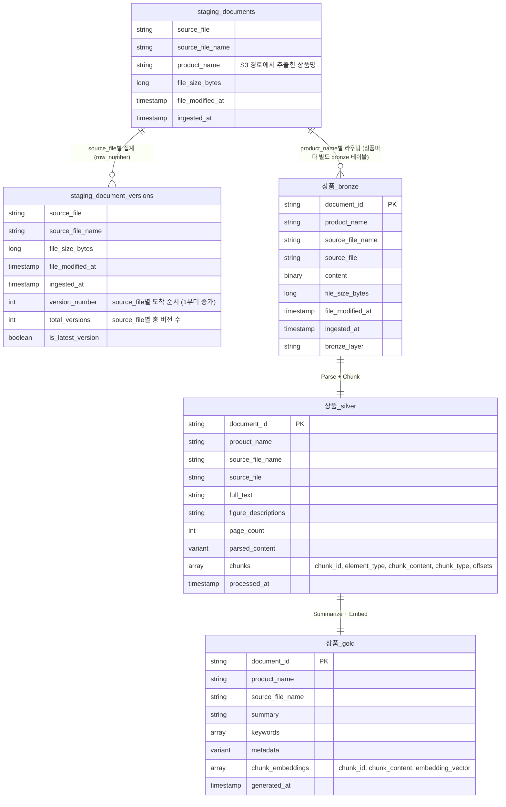

# dev_haesung ERD (Entity Relationship Diagram)

> **주의**: 이 문서는 상품별 테이블 분리 구조로 전환할 **예정(target) 구조**를 나타냅니다.
> 현재 저장소의 `staging/`, `bronze/`, `silver/`, `gold/` 코드는 아직 상품 단일(고정 테이블명) 구조이며,
> 이 문서에 맞춘 코드 리팩터링은 별도로 진행합니다.

## 구조 개요

- **Staging** (`dev_haesung.보험` 스키마): S3(`s3://.../보험/`)에서 들어오는 모든 문서의 메타데이터를 상품 구분 없이 하나의 테이블(`staging_documents`)로 수집합니다. S3 경로상 `보험/<상품>/...` 형태이므로, 파일 경로에서 상품명을 추출해 `product_name` 컬럼으로 보관합니다.
- **Bronze / Silver / Gold**: S3의 `<상품>` 폴더 단위로 파이프라인이 분리되어, 레이어당 상품 접두사가 붙은 테이블 1개씩 생성됩니다.
  - `<상품>_bronze` (`dev_haesung.bronze` 스키마)
  - `<상품>_silver` (`dev_haesung.silver` 스키마) — 파싱 + 청킹(nested array)까지 한 테이블에 포함
  - `<상품>_gold` (`dev_haesung.gold` 스키마) — AI 요약 + 청크별 임베딩까지 한 테이블에 포함
- 아래 다이어그램은 `<상품>` 자리에 placeholder로 `상품`을 사용한 **템플릿 1세트**입니다. 실제로는 S3의 상품 폴더 수만큼 이 3개 테이블 세트가 반복 생성됩니다 (예: `종신보험_bronze`/`종신보험_silver`/`종신보험_gold`, `CI보험_bronze`/`CI보험_silver`/`CI보험_gold` ...).

## ERD

## 테이블 상세

### staging_documents (`dev_haesung.보험`)

| 컬럼 | 타입 | 키 | 설명 |
|---|---|---|---|
| source_file | STRING | | S3 원본 파일 경로 |
| source_file_name | STRING | | 파일명 |
| product_name | STRING | | S3 경로(`보험/<상품>/...`)에서 추출한 상품명 — 다운스트림 상품별 테이블 라우팅에 사용 |
| file_size_bytes | LONG | | 파일 크기 (bytes) |
| file_modified_at | TIMESTAMP | | S3 파일 수정 시각 |
| ingested_at | TIMESTAMP | | 메타데이터 수집 시각 |

### staging_document_versions (`dev_haesung.staging`, Materialized View)

> `staging_documents`는 동일 `source_file`이 재업로드(S3 버저닝 + Auto Loader `allowOverwrites=true`)될 때마다 새 행을 append하는 이벤트 원장입니다. 이 테이블은 그 원장을 `source_file` 기준으로 집계해 버전 번호와 최신 버전 여부를 계산합니다.

| 컬럼 | 타입 | 키 | 설명 |
|---|---|---|---|
| source_file | STRING | | S3 원본 파일 경로 |
| source_file_name | STRING | | 파일명 |
| file_size_bytes | LONG | | 파일 크기 (bytes) |
| file_modified_at | TIMESTAMP | | S3 파일 수정 시각 |
| ingested_at | TIMESTAMP | | 메타데이터 수집 시각 |
| version_number | INT | | `source_file`별 도착 순서 (1부터 증가, `file_modified_at`/`ingested_at` 기준) |
| total_versions | INT | | `source_file`별 누적 버전 수 |
| is_latest_version | BOOLEAN | | 해당 행이 `source_file`의 최신 버전인지 여부 |

### `<상품>_bronze` (`dev_haesung.bronze`)

| 컬럼 | 타입 | 키 | 설명 |
|---|---|---|---|
| document_id | STRING | PK | 문서 고유 ID (생성 규칙: `source_file_name`에서 마지막 확장자 제거, 예: `agreement_v1.md` → `agreement_v1`) |
| product_name | STRING | | 상품명 |
| source_file_name | STRING | | 파일명 |
| source_file | STRING | | S3 원본 파일 경로 |
| content | BINARY | | 원본 바이너리 콘텐츠 |
| file_size_bytes | LONG | | 파일 크기 (bytes) |
| file_modified_at | TIMESTAMP | | S3 파일 수정 시각 |
| ingested_at | TIMESTAMP | | staging 수집 시각 |
| bronze_layer | STRING | | 레이어 태그 (`"bronze"`) |

> **document_id 생성 로직**: `source_file_name`(경로 제외 파일명)에서 정규식 `\.[^.]+$`로 마지막 확장자만 제거해 생성합니다 (`bronze_documents.py` 구현 기준). 경로는 반영되지 않으므로 서로 다른 폴더에 동일 파일명이 있으면 충돌하며, 동일 파일명으로 재업로드(버전 갱신) 시에도 동일한 `document_id`가 재사용됩니다.

### `<상품>_silver` (`dev_haesung.silver`)

| 컬럼 | 타입 | 키 | 설명 |
|---|---|---|---|
| document_id | STRING | PK | 문서 고유 ID |
| product_name | STRING | | 상품명 |
| source_file_name | STRING | | 파일명 |
| source_file | STRING | | S3 원본 파일 경로 |
| full_text | STRING | | 텍스트 요소 평문 (figure 제외) |
| figure_descriptions | STRING | | 그림/차트 AI 설명 |
| page_count | INT | | 페이지 수 |
| parsed_content | VARIANT | | `ai_parse_document()` 원본 출력 |
| chunks | ARRAY<STRUCT> | | 문서 내 청크 배열 (`overlap_chunk` UDF 결과: chunk_id, element_type, chunk_content, chunk_type, start/end offset 등) — 기존 `silver_document_chunks` 별도 테이블을 이 컬럼으로 통합 |
| processed_at | TIMESTAMP | | 파싱/청킹 처리 시각 |

### `<상품>_gold` (`dev_haesung.gold`)

| 컬럼 | 타입 | 키 | 설명 |
|---|---|---|---|
| document_id | STRING | PK | 문서 고유 ID |
| product_name | STRING | | 상품명 |
| source_file_name | STRING | | 파일명 |
| summary | STRING | | AI 생성 한국어 요약 (3~5문장) |
| keywords | ARRAY<STRING> | | AI 추출 키워드 목록 |
| metadata | VARIANT | | 문서 분류/민감도 등 AI 추출 메타데이터 |
| chunk_embeddings | ARRAY<STRUCT> | | 청크별 임베딩 배열 (chunk_id, chunk_content, embedding_vector) — 기존 `gold_document_embeddings` / Vector Index 소스를 이 컬럼으로 통합. Vector Search는 이 배열을 unnest한 뷰를 소스로 동기화 |
| generated_at | TIMESTAMP | | 요약/임베딩 생성 시각 |

---

> `product_name` 값(=S3 `보험/<상품>/` 폴더명)에 따라 `<상품>_bronze` / `<상품>_silver` / `<상품>_gold` 3개 테이블이 상품 수만큼 반복 생성됩니다. staging은 상품 구분 없이 `dev_haesung.보험.staging_documents` 하나로 공유됩니다.
