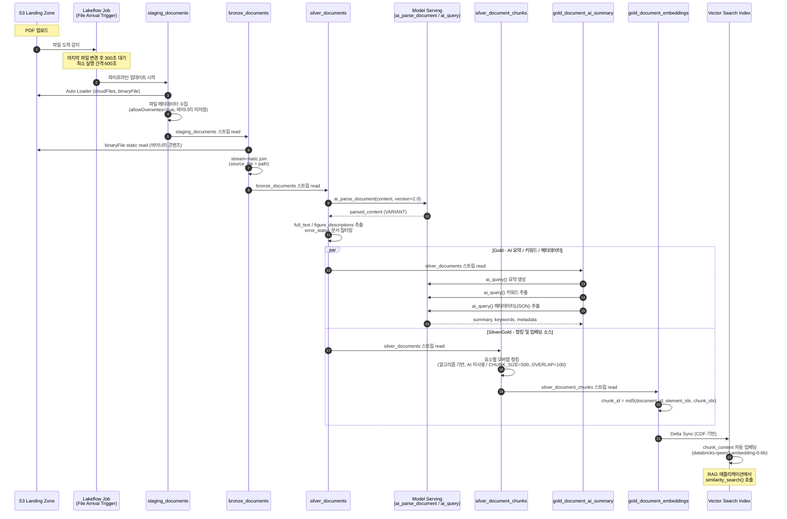
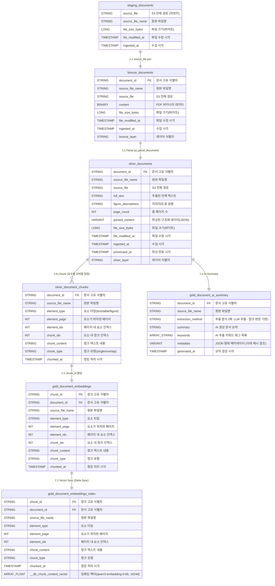
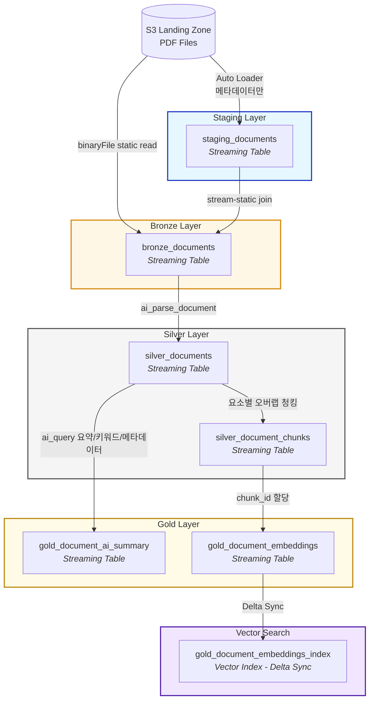

# dev_haesung — 데이터 파이프라인 아키텍처

## Overview

- **Catalog:** `dev_haesung`
- **Schemas:** `staging`, `bronze`, `silver`, `gold`
- **Pipeline:** `databricks-pipeline-sample` (보험 문서 RAG 파이프라인)
- **Pipeline ID:** `454e3aef-72c9-48da-80f7-4910933e8b4e`
- **Last updated:** 2026-08-23 (staging 레이어 반영)

S3 Landing Zone에 적재된 보험 PDF 문서를 Auto Loader로 수집하고, Databricks AI 함수(`ai_parse_document`, `ai_query`)로 텍스트를 추출·요약·청킹한 뒤 Vector Search 인덱스와 동기화하여 RAG(Retrieval-Augmented Generation)에 활용하는 Lakeflow Declarative Pipeline입니다.

---

## 파이프라인 시퀀스 흐름 (Mermaid)

File Arrival 트리거부터 Vector Search 동기화까지의 처리 순서입니다.



---

## ERD (Mermaid)



> **참고**: `staging_documents`, `silver_document_chunks`, `gold_document_ai_summary`는 코드상 명시적 PK 제약이 선언되어 있지 않습니다. `bronze_documents`, `silver_documents`, `gold_document_embeddings`만 스키마에 `CONSTRAINT ... PRIMARY KEY`가 명시되어 있습니다.

---

## Data Flow Diagram



---

## Table Details

### 1. staging_documents

| Property | Value |
|----------|-------|
| Type | Streaming Table |
| Layer | Staging |
| Source | S3 Landing Zone (Auto Loader, `cloudFiles.allowOverwrites=true`) |
| Description | S3 파일 메타데이터 및 버전 이력 추적 (바이너리 콘텐츠는 저장하지 않음) |
| Primary Key | 없음 (`source_file`이 사실상 자연키) |

### 2. bronze_documents

| Property | Value |
|----------|-------|
| Type | Streaming Table |
| Layer | Bronze |
| Source | `staging_documents` (stream) + S3 binaryFile (static) |
| Description | S3에서 PDF 파일을 수집한 원시 바이너리 데이터 |
| Primary Key | `document_id` |

### 3. silver_documents

| Property | Value |
|----------|-------|
| Type | Streaming Table |
| Layer | Silver |
| Source | `bronze_documents` |
| Description | ai_parse_document()로 PDF 텍스트를 추출·정제한 데이터 |
| Primary Key | `document_id` |

### 4. silver_document_chunks

| Property | Value |
|----------|-------|
| Type | Streaming Table |
| Layer | Silver |
| Source | `silver_documents` |
| Description | 문서 요소별 오버랩 텍스트 청킹 - RAG 벡터검색용 (AI 미사용, 고정 길이 슬라이딩 윈도우) |
| Foreign Key | `document_id` → `silver_documents.document_id` |

### 5. gold_document_ai_summary

| Property | Value |
|----------|-------|
| Type | Streaming Table |
| Layer | Gold |
| Source | `silver_documents` |
| Description | 문서별 AI 요약 및 메타데이터 (생명보험 도메인) |
| Foreign Key | `document_id` → `silver_documents.document_id` |

**`metadata` 컬럼 JSON 구조 예시** (현재 `ai_query()` 프롬프트가 요청하는 필드 기준):

```json
{
  "doc_category": "약관",
  "insurance_product_type": "종신보험",
  "related_systems": ["보험코어", "언더라이팅", "CRM"],
  "sensitivity_level": "내부",
  "regulation_reference": "보험업법 제127조"
}
```

### 6. gold_document_embeddings

| Property | Value |
|----------|-------|
| Type | Streaming Table |
| Layer | Gold |
| Source | `silver_document_chunks` |
| Description | Vector Search 소스 테이블 (임베딩은 Vector Search가 자동 계산) |
| Primary Key | `chunk_id` |
| Foreign Key | `document_id` → `silver_documents.document_id` |
| CDF | `delta.enableChangeDataFeed = true` |

### 7. gold_document_embeddings_index

| Property | Value |
|----------|-------|
| Type | Foreign Table (Vector Index) |
| Layer | Gold |
| Source | `gold_document_embeddings` (Delta Sync) |
| Description | Managed Vector Index - chunk_content 컬럼에서 벡터 자동 생성 |
| Primary Key | `chunk_id` |
| Embedding Model | `databricks-qwen3-embedding-0-6b` (1024 dimensions) |
| Endpoint | `document-search-endpoint` (STANDARD) |

---

## Lineage Summary

```
S3 (PDF)
 └── staging_documents              [메타데이터만, 바이너리 미저장]
      └── bronze_documents          [stream-static join]
           └── silver_documents     [ai_parse_document]
                ├── silver_document_chunks     [요소별 오버랩 청킹]
                │    └── gold_document_embeddings  [chunk_id 할당]
                │         └── gold_document_embeddings_index  [Vector Search Delta Sync]
                └── gold_document_ai_summary   [ai_query 요약/키워드/메타데이터]
```
