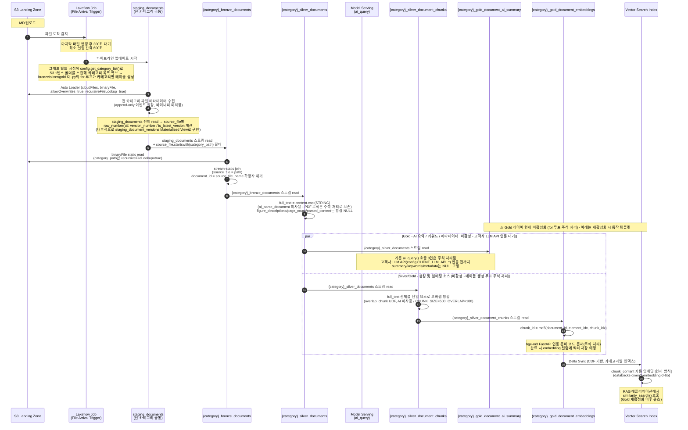
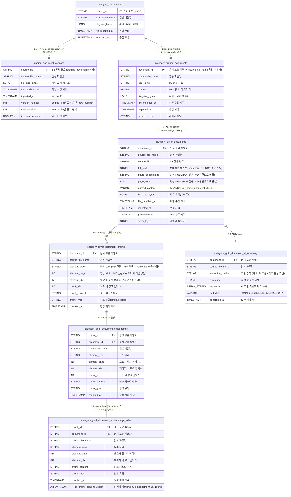
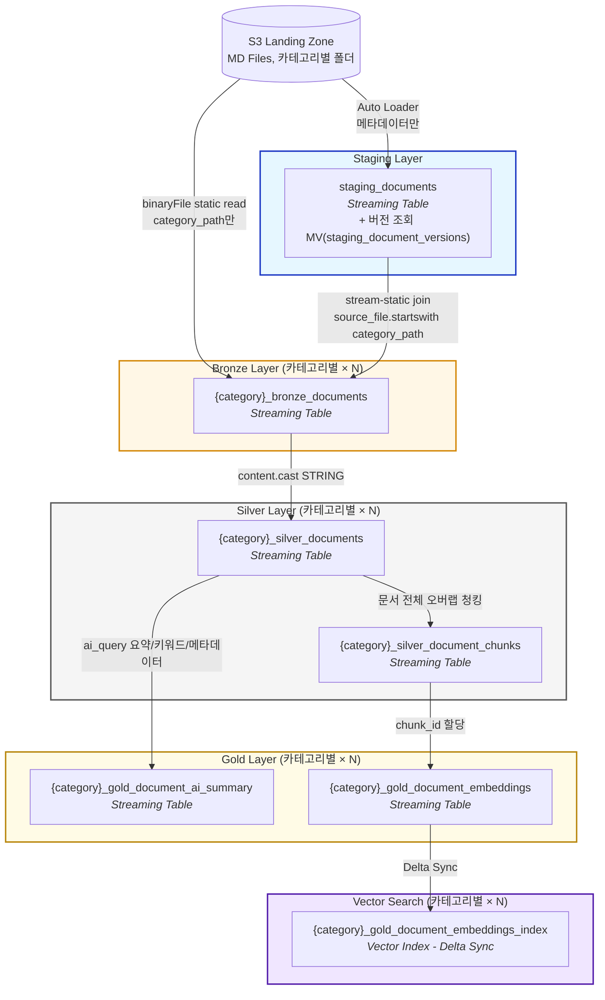

# 보험 — 데이터 파이프라인 아키텍처

## Overview

- **Schema:** `보험`
- **Layers:** `staging`, `bronze`, `silver`, `gold`
- **테이블 네이밍**: `staging`은 전 카테고리 공통 단일 테이블(`staging_documents`)이고, `bronze`/`silver`/`gold`는 카테고리별로 동적 생성되는 `{카테고리명}_{원래 테이블명}` 구조입니다 (예: `CRM_bronze_documents`, `CRM_silver_documents`, `CRM_gold_document_ai_summary`). `config.get_category_list()`가 파이프라인 그래프 빌드 시점에 S3 Landing Zone(`보험/` 바로 아래 1뎁스 폴더)을 스캔해 카테고리 목록을 얻고, 각 bronze/silver/gold 파이프라인 파일이 그 목록으로 for 루프를 돌며 카테고리마다 테이블을 생성합니다 — 자세한 내용은 [staging_documents 섹션](#1-staging_documents)의 참고 참조.
- **Pipeline:** `databricks-pipeline-sample` (보험 문서 RAG 파이프라인)
- **Pipeline ID:** `454e3aef-72c9-48da-80f7-4910933e8b4e`
- **Last updated:** 2026-08-26 (Gold 레이어 일시 비활성화 반영 — 고객사 LLM API / 타 팀 bge-m3 임베딩 API 연동 대기, 테이블명 카탈로그 접두사 제거)

S3 Landing Zone(`s3://a-s3-dbx-dev-ane2-aegis01/보험/`)에 적재된 보험 문서(MD)를 Auto Loader로 수집하고, 텍스트를 정제·청킹하는 Lakeflow Declarative Pipeline입니다. Bronze/Silver 레이어는 활성 상태로 운영 중이며, Gold 레이어(AI 요약·임베딩·Vector Search 동기화)는 아래 **파이프라인 현재 상태** 참고와 같이 외부 연동 대기로 일시 비활성화되어 있습니다.

> **소스 포맷 전환**: 파이프라인은 원래 PDF + `ai_parse_document()` 기반으로 설계되었으나, 현재는 MD 파일 업로드를 전제로 `ai_parse_document()` 호출 없이 바이너리 콘텐츠를 텍스트로 직접 디코딩합니다. 기존 PDF 파싱/요소별 청킹 로직은 삭제하지 않고 각 노트북에 주석 처리로 보존되어 있어 PDF로 복귀 시 재활성화할 수 있습니다.

> **파이프라인 현재 상태 (Gold 레이어 일시 비활성화)**: `gold_document_ai_summary.py` / `gold_document_embeddings.py` 두 파일 모두 최상위 `for _category in config.get_category_list(): ...` 테이블 생성 루프와 `import config`가 주석 처리되어 있어, 현재 파이프라인 그래프에는 **Gold 레이어 테이블이 생성되지 않습니다**. 함수 정의(`_generate_gold_document_ai_summary`, `_generate_gold_document_embeddings`) 자체는 코드에 남아 있으므로 아래 두 외부 연동이 준비되면 for 루프 주석만 해제해 즉시 재활성화할 수 있는 구조입니다.
> - **AI 요약/키워드/메타데이터**: 기존 Databricks `ai_query()` 방식은 주석 처리로 비활성화되었고, 고객사가 제공할 LLM API(`config.CLIENT_LLM_API_*`, OpenAI 호환 chat completions 스펙 가정)로 대체될 예정입니다. 연동 전까지는 활성화되더라도 `summary`/`keywords`/`metadata`가 모두 `NULL`로 채워집니다 — 자세한 내용은 [5. gold_document_ai_summary 섹션](#5-카테고리명_gold_document_ai_summary) 참고.
> - **임베딩**: 기존에는 Vector Search가 `chunk_content`에서 자동으로 임베딩을 계산(`databricks-qwen3-embedding-0-6b`, `embedding_source_columns` 방식)했으나, 다른 팀이 개발 중인 외부 bge-m3 FastAPI 임베딩 서비스가 완료되면 파이프라인이 직접 API를 호출해 `embedding` 컬럼에 벡터를 저장하는 방식(`embedding_vector_column`)으로 전환할 계획입니다 — 자세한 내용은 [6. gold_document_embeddings 섹션](#6-카테고리명_gold_document_embeddings) 참고.

---

## 파이프라인 시퀀스 흐름 (Mermaid)

File Arrival 트리거부터 Vector Search 동기화까지의 처리 순서입니다. bronze/silver/gold는 카테고리별로 동적 생성되므로, 아래 흐름은 카테고리 하나(`{category}`)에 대한 템플릿이며 실제로는 `config.get_category_list()`가 반환하는 카테고리 수만큼 병렬로 반복됩니다. **Gold 구간(요약~Vector Search)은 현재 파이프라인에서 비활성화되어 있으며(위 파이프라인 현재 상태 참고), 아래 다이어그램은 재활성화 시 동작할 흐름을 보여줍니다.**



---

## ERD (Mermaid)



> **참고(Gold 레이어 현재 비활성화)**: `category_gold_document_ai_summary`, `category_gold_document_embeddings`, `category_gold_document_embeddings_index` 및 이들과 연결된 관계는 코드상 정의는 존재하지만, 테이블 생성 for 루프가 주석 처리되어 있어 현재 스키마에는 실제로 생성되어 있지 않습니다. 위 파이프라인 현재 상태 참고.
>
> **참고(카테고리별 반복)**: 위 ERD는 카테고리 하나에 대한 템플릿이며, `category_`로 시작하는 엔티티명은 실제로는 `{카테고리명}_`가 붙습니다(예: `category_bronze_documents` → `CRM_bronze_documents`). `config.get_category_list()`가 반환하는 카테고리마다 `bronze_documents.py` / `silver_documents.py` / `silver_document_chunks.py` / `gold_document_ai_summary.py` / `gold_document_embeddings.py`가 각각 for 루프로 실제 테이블 세트를 생성하므로, 실제 스키마에는 카테고리 수 × 5개(+ Vector Search 인덱스)의 물리 테이블이 존재합니다. `staging_documents`(및 `staging_document_versions`)만 전 카테고리 공통 단일 테이블입니다.

> **참고**: `staging_documents`, `staging_document_versions`, `{카테고리명}_silver_document_chunks`, `{카테고리명}_gold_document_ai_summary`는 코드상 명시적 PK 제약이 선언되어 있지 않습니다. `{카테고리명}_bronze_documents`, `{카테고리명}_silver_documents`, `{카테고리명}_gold_document_embeddings`만 스키마에 `CONSTRAINT ... PRIMARY KEY`가 명시되어 있습니다.
>
> **참고(버전 조회)**: `staging_document_versions`는 `staging_documents`를 `source_file` 기준으로 읽어 `row_number()`/`max()` 윈도우 함수로 `version_number` / `total_versions` / `is_latest_version`을 계산해 붙이는 별도 Materialized View입니다. 물리적으로 분리된 오브젝트이므로 위 ERD에서도 별도 엔티티로 표현했습니다. Bronze 레이어는 이 파생 뷰가 아니라 `staging_documents`를 직접 스트리밍으로 읽습니다.
>
> **참고(S3 버전 관리)**: S3 버킷 버저닝은 콘솔에서 활성화되어 있으나, 위 버전 컬럼들은 메타데이터(도착 순서/최신 여부)만 추적할 뿐 과거 버전의 실제 파일 콘텐츠는 저장/대조하지 않습니다. S3 VersionId와 연동한 콘텐츠 히스토리 조회는 범위 외(TODO)입니다.

---

## Data Flow Diagram



> **참고**: `Gold`/`VectorSearch` 서브그래프는 현재 파이프라인에서 비활성화된 구간입니다(테이블 생성 for 루프 주석 처리). 실제로는 `Silver` 레이어까지만 매 트리거마다 갱신됩니다.

---

## Table Details

### 1. staging_documents

| Property | Value |
|----------|-------|
| Type | Streaming Table |
| Layer | Staging |
| Source | S3 Landing Zone (Auto Loader, `cloudFiles.allowOverwrites=true`, `recursiveFileLookup=true`) |
| Description | S3 파일 메타데이터 및 버전 이력 추적 (append-only 이벤트 원장, 바이너리 콘텐츠는 저장하지 않음) |
| Primary Key | 없음 (`source_file`이 사실상 자연키) |

> **참고(카테고리별 분기 방식)**: `staging_documents.py` 상단 docstring은 `category_name` 컬럼을 추출해 그 컬럼 기준으로 분기하는 방식을 언급하지만, 실제 구현은 `staging_documents`에 컬럼을 추가하는 대신 **bronze 레이어에서 `source_file` 경로 접두사로 직접 필터링**하는 방식을 사용합니다. `config.get_category_list()`가 파이프라인 그래프 빌드 시점에 S3 Landing Zone(`보험/` 바로 아래 1뎁스 폴더)을 스캔해 카테고리 목록을 얻고, `bronze_documents.py`/`silver_documents.py`/`silver_document_chunks.py`/`gold_document_ai_summary.py`/`gold_document_embeddings.py`가 각각 그 목록으로 for 루프를 돌며 `{카테고리명}_bronze_documents`, `{카테고리명}_silver_documents` 등 카테고리별 테이블 세트를 생성합니다. `staging_documents` 자체는 카테고리 구분 없이 전 카테고리 공통 스키마·단일 테이블을 유지합니다.

**버전 조회 (staging_document_versions)**: `staging_documents`는 append-only 이벤트 원장이라 재업로드된 파일도 새 행으로만 쌓입니다. 이를 `source_file` 기준으로 묶어 도착 순서(`version_number`)와 최신 버전 여부(`is_latest_version`)를 보기 쉽게 만드는 별도 Materialized View `staging_document_versions`(`보험.staging`, PK 없음)가 함께 정의되어 있습니다. 물리적으로는 별개 객체이지만 `staging_documents`를 그대로 읽어 `row_number()`/`max()` 윈도우 함수만 얹은 파생 뷰이므로 이 문서에서는 하나로 묶어 설명합니다.

> **TODO**: 버전은 메타데이터(도착 이력) 기준으로만 관리되며, 과거 버전의 실제 파일 바이너리 콘텐츠는 저장/대조하지 않습니다. S3 버킷 버저닝(콘솔에서 설정 완료)의 VersionId와 연동한 실제 콘텐츠 히스토리 조회는 이번 범위에서 제외 — 필요 시 별도 작업으로 진행.

### 2. {카테고리명}_bronze_documents

| Property | Value |
|----------|-------|
| Type | Streaming Table (카테고리별 동적 생성, `bronze_documents.py`의 `for _category in config.get_category_list(): _generate_bronze_documents(_category)`) |
| Layer | Bronze |
| Source | `staging_documents` (stream, `source_file.startswith(category_path)` 필터) + S3 binaryFile (static, `category_path`만 `recursiveFileLookup=true`) |
| Description | 해당 카테고리 폴더의 문서 파일(MD)을 수집한 원시 바이너리 데이터 |
| Primary Key | `document_id` (제약명 `` `pk_{카테고리명}_bronze_documents` ``) |

**`document_id` 생성 규칙**: `source_file_name`(경로 제외 파일명)에서 마지막 확장자만 정규식(`\.[^.]+$`)으로 제거한 값을 그대로 사용합니다 (예: `agreement_v1.md` → `agreement_v1`). 경로(`source_file`)는 사용하지 않으므로 같은 카테고리 폴더 내 서로 다른 하위 폴더에 동일 파일명이 존재하거나 파일이 재업로드(버전 갱신)되면 동일한 `document_id`가 재사용되어 PK 제약과 충돌/갱신될 수 있습니다. 다른 카테고리끼리는 테이블 자체가 분리되어 있어 충돌하지 않습니다.

> **TODO**: 현재는 매 트리거마다 S3의 "현재" 바이너리를 static join으로 읽어오므로, `staging_document_versions`에 기록된 과거 버전의 실제 파일 내용(바이너리)은 보존되지 않습니다. S3 버킷 버저닝의 VersionId와 연동해 과거 버전 콘텐츠까지 조회/대조하는 기능은 이번 범위에서 제외 — 필요 시 별도 작업으로 진행.

### 3. {카테고리명}_silver_documents

| Property | Value |
|----------|-------|
| Type | Streaming Table (카테고리별 동적 생성) |
| Layer | Silver |
| Source | `{카테고리명}_bronze_documents` |
| Description | 해당 카테고리 MD 파일 텍스트를 추출·정제한 데이터 (`ai_parse_document()` 미사용) |
| Primary Key | `document_id` (제약명 `` `pk_{카테고리명}_silver_documents` ``) |

`full_text`는 `content`를 `STRING`으로 캐스팅한 MD 원문이며, `figure_descriptions` / `page_count` / `parsed_content`는 PDF 전용 필드로 MD 전환 후 항상 `NULL`입니다. 기존 `ai_parse_document()` 기반 파싱 로직(figure 설명 추출, HTML 표 태그 정리, `error_status` 필터링 등)은 삭제하지 않고 주석 처리로 보존되어 있으며, 현재는 `full_text`가 비어있지 않은 문서만 필터링합니다.

### 4. {카테고리명}_silver_document_chunks

| Property | Value |
|----------|-------|
| Type | Streaming Table (카테고리별 동적 생성) |
| Layer | Silver |
| Source | `{카테고리명}_silver_documents` |
| Description | 문서 전체(`full_text`)를 단일 요소로 오버랩 청킹 - RAG 벡터검색용 (`overlap_chunk` Python UDF, AI 미사용) |
| Foreign Key | `document_id` → `{카테고리명}_silver_documents.document_id` (제약명 `` `fk_{카테고리명}_chunks_document` ``) |

기존에는 `ai_parse_document()` 결과의 요소(text/table/figure)별로 청킹했으나, MD 전환으로 요소 구분이 사라져 `element_type="text"`, `element_page=NULL`, `element_idx=0` 고정값으로 문서 전체를 단일 요소 취급합니다. 청킹 자체도 기존 SQL `sequence`/`substr` 기반 방식에서 `overlap_chunk` UDF(Python 슬라이딩 윈도우, `chunk_index`/`chunk_text`/`start_offset`/`end_offset` 반환)로 대체되었습니다. 두 기존 로직 모두 삭제하지 않고 주석 처리로 보존되어 있습니다.

### 5. {카테고리명}_gold_document_ai_summary

> **⚠ 현재 비활성화**: `gold_document_ai_summary.py` 최하단의 `for _category in config.get_category_list(): _generate_gold_document_ai_summary(_category)` 루프와 `import config`가 주석 처리되어 있어, 현재 파이프라인 그래프에는 이 테이블이 **생성되지 않습니다**. 아래 내용은 재활성화 시(주석 해제 시) 적용될 스키마/동작입니다.

| Property | Value |
|----------|-------|
| Type | Streaming Table (카테고리별 동적 생성 — 현재 생성 루프 주석 처리로 비활성) |
| Layer | Gold |
| Source | `{카테고리명}_silver_documents` |
| Description | 해당 카테고리 문서별 AI 요약 및 메타데이터 (생명보험 도메인) |
| Foreign Key | `document_id` → `{카테고리명}_silver_documents.document_id` (제약명 `` `fk_{카테고리명}_summary_document` ``) |

**요약 방식 전환**: 기존에는 Databricks 내장 `ai_query()`로 요약/키워드/메타데이터를 직접 생성했으나, 이 로직 전체가 주석 처리되어 비활성화되었습니다. 대신 고객사가 API 형태로 제공할 LLM(`config.CLIENT_LLM_API_*` — URL/인증키/모델명/타임아웃)을 호출하는 방식으로 교체될 예정이며, 호출용 `pandas_udf`(요청 페이로드는 OpenAI 호환 chat completions 스펙 가정, 인증키는 `dbutils.secrets.get()`으로 조회) 준비 코드가 주석 처리된 채로 파일에 이미 작성되어 있습니다. **고객사로부터 API 전달이 완료되면 해당 주석을 해제하고 `config.py`의 `CLIENT_LLM_API_*` 값을 실제 값으로 채우면 됩니다.**

**현재(연동 전) 동작**: 두 요약 방식 모두 비활성 상태이므로, 실제 `select()`는 아래처럼 고정값만 반환합니다.

| Column | 현재 값 |
|--------|---------|
| `extraction_method` | 리터럴 `"고객사 LLM API 연동 대기 (준비 코드 작성 완료)"` |
| `summary` | `NULL` |
| `keywords` | `NULL` |
| `metadata` | `NULL` (VARIANT) |

**`metadata` 필드 정의는 `config.py`의 `METADATA_SCHEMA`에서 관리합니다.** 필드를 추가/변경/삭제하려면
`gold_document_ai_summary.py`의 프롬프트 문자열을 직접 고칠 필요 없이 `config.METADATA_SCHEMA`만 수정하면
됩니다 — 프롬프트는 `config.build_metadata_prompt_fields()`가 이 정의를 읽어 자동 생성합니다
(고객사 LLM API 연동 후 이 스키마가 그대로 적용됩니다).

**`metadata` 컬럼 JSON 구조 예시** (현재 `config.METADATA_SCHEMA` 정의 기준, 연동 완료 후 실제 채워질 형태):

```json
{
  "doc_category": "약관",
  "insurance_product_type": "종신보험",
  "related_systems": ["보험코어", "언더라이팅", "CRM"],
  "sensitivity_level": "내부",
  "regulation_reference": "보험업법 제127조"
}
```

### 6. {카테고리명}_gold_document_embeddings

> **⚠ 현재 비활성화**: `gold_document_embeddings.py`도 동일하게 최하단 `for _category in config.get_category_list(): _generate_gold_document_embeddings(_category)` 루프와 `import config`가 주석 처리되어 있어 현재 생성되지 않습니다.

| Property | Value |
|----------|-------|
| Type | Streaming Table (카테고리별 동적 생성 — 현재 생성 루프 주석 처리로 비활성) |
| Layer | Gold |
| Source | `{카테고리명}_silver_document_chunks` |
| Description | 해당 카테고리 Vector Search 소스 테이블 |
| Primary Key | `chunk_id` (제약명 `` `pk_{카테고리명}_gold_embeddings` ``) |
| Foreign Key | `document_id` → `{카테고리명}_silver_documents.document_id` (제약명 `` `fk_{카테고리명}_embeddings_document` ``) |
| CDF | `delta.enableChangeDataFeed = true` |

**임베딩 계산 방식 전환 (진행 중)**:

| | 기존 방식 (현재 인프라) | 신규 방식 (연동 준비, 다른 팀 개발 완료 대기) |
|---|---|---|
| 계산 주체 | Vector Search가 `chunk_content`에서 자동 계산 | 파이프라인이 직접 외부 API 호출 후 저장 |
| 모델/서비스 | `databricks-qwen3-embedding-0-6b` | 다른 팀이 개발 중인 bge-m3 FastAPI 서비스 (`config.EMBEDDING_API_*`) |
| 인덱스 연동 방식 | `embedding_source_columns` | `embedding_vector_column="embedding"` |
| 테이블 컬럼 | 없음 (Vector Search가 인덱스 쪽에서 계산) | `embedding ARRAY<FLOAT>` 컬럼 추가 필요 |
| 현재 상태 | Vector Search 인프라 자체는 이 방식 기준으로 유지 중 | 호출용 `pandas_udf`(`embed_with_bge_m3_api`, 배치 크기 `EMBEDDING_API_BATCH_SIZE`) 준비 코드가 주석 처리된 채 작성됨 |

다른 팀의 bge-m3 서비스 개발이 완료되면 `embed_with_bge_m3_api` 관련 주석을 해제하고, `@dp.table` 스키마와 최종 `select()`에 `embedding ARRAY<FLOAT>` 컬럼을 추가한 뒤 `config.py`의 `EMBEDDING_API_*` 값을 실제 값으로 설정하는 순서로 전환합니다.

### 7. {카테고리명}_gold_document_embeddings_index

> **⚠ 현재 비활성화**: 소스 테이블(`{카테고리명}_gold_document_embeddings`)이 생성되지 않으므로 이 인덱스도 현재는 생성/동기화되지 않습니다.

| Property | Value |
|----------|-------|
| Type | Foreign Table (Vector Index) |
| Layer | Gold |
| Source | `{카테고리명}_gold_document_embeddings` (Delta Sync) |
| Description | 해당 카테고리 Managed Vector Index |
| Primary Key | `chunk_id` |
| Embedding Model (기존 방식) | `databricks-qwen3-embedding-0-6b` (1024 dimensions) |
| Embedding (신규 방식, 대기 중) | 파이프라인이 저장한 `embedding` 컬럼 그대로 사용 (bge-m3, `config.EMBEDDING_API_DIMENSION`=1024) |
| Endpoint | `document-search-endpoint` (STANDARD, 카테고리 간 공용) |

> **참고**: 이 인덱스는 파이프라인 `.py` 코드가 아니라 별도 노트북/스크립트에서 `VectorSearchClient.create_delta_sync_index()`로 생성합니다. 두 방식(기존 `embedding_source_columns` / 신규 `embedding_vector_column`)의 구체적인 호출 코드가 이제 `gold_document_embeddings.py` 상단 docstring에 카테고리 반복 예시(`for category in config.get_category_list(): vsc.create_delta_sync_index(...)`)와 함께 문서화되어 있습니다 — 다만 이 코드는 실행 자동화가 아니라 안내용 스니펫이며, 실제 실행은 여전히 파이프라인 밖에서 수동으로 이뤄집니다.

---

## Lineage Summary

```
S3 (MD, 카테고리별 1뎁스 폴더: 보험/{카테고리명}/...)
 └── staging_documents (전 카테고리 공통)   [메타데이터만, append-only 이벤트 원장, 바이너리 미저장]
      │    (+ 버전 조회 MV staging_document_versions: source_file별 version_number / is_latest_version)
      └── (카테고리마다 반복: config.get_category_list())
           └── {카테고리명}_bronze_documents      [source_file.startswith(category_path) 필터 + stream-static join]
                └── {카테고리명}_silver_documents  [content.cast(STRING), ai_parse_document 미사용]
                     │    ⚠ 아래 Gold 레이어는 테이블 생성 for 루프 주석 처리로 현재 비활성 (재활성화 시 동작 예정)
                     ├── {카테고리명}_silver_document_chunks     [문서 전체 오버랩 청킹 - overlap_chunk UDF]
                     │    └── {카테고리명}_gold_document_embeddings  [chunk_id 할당 + (연동 대기) bge-m3 API 임베딩]
                     │         └── {카테고리명}_gold_document_embeddings_index  [Vector Search Delta Sync, 별도 스크립트로 생성]
                     └── {카테고리명}_gold_document_ai_summary   [(연동 대기) 고객사 LLM API 요약/키워드/메타데이터 - 현재 NULL]
```
